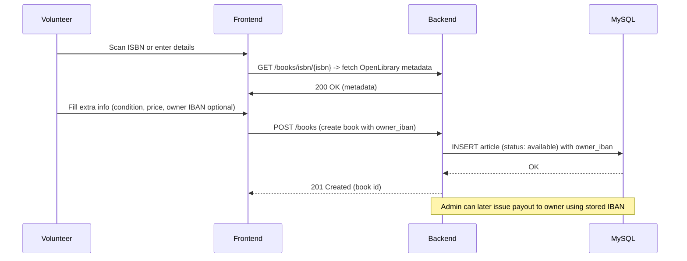

# Caribooks - Plateforme E-Commerce Solidaire


## 📖 Contexte du Projet

**Caribooks** est une plateforme de vente en ligne de livres de seconde main, développée pour **Caritas**. Ce projet a été initié pour résoudre le problème des livres invendus dans les recycleries, dont les bénéfices financent la réinsertion professionnelle.

### Contraintes spécifiques :
- **Devise unique :** Toutes les transactions sont exclusivement en Francs Suisses (CHF).
- **Zone géographique :** La livraison est strictement limitée à la Suisse.
- **Ergonomie bénévole :** Le back-office intègre un système d'ajout rapide de livres au catalogue via un scan de code ISBN.

---

## 🏗 Architecture du Projet


Le projet suit les principes **SOLID**, **Clean Architecture** et **KISS**, et est divisé en deux parties principales :

**⚠️ Contraintes techniques supplémentaires :**
- **Base de données :** L'application fonctionne exclusivement avec une base de données **mySQL** (et non SQLite ou PostgreSQL).
- **API ISBN :** Toutes les métadonnées des livres sont récupérées via l'API **OpenLibrary** (https://openlibrary.org/dev/docs/api/books).

1. **Backend (API REST) - `FastAPI` :** 
   - Gère la logique métier, la base de données, l'authentification et l'intégration avec l'API ISBN pour récupérer les métadonnées des livres.
2. **Frontend - `Next.js` :** 
   - Offre une interface utilisateur fluide pour les clients finaux (vitrine e-commerce) et un back-office simplifié pour les bénévoles de Caritas.

---

## 🌐 Déploiement (production)

Architecture cloud hybride à coût nul (offres gratuites) :

- **Frontend (Next.js)** : hébergé sur **Vercel** (CDN global, auto-deploy).
- **Backend / API (FastAPI)** : **deux VMs Oracle Cloud** (AMD Micro, *Always Free*, Ubuntu 22.04) — `VM1` sert le trafic de production, `VM2` est maintenue à jour en parallèle comme instance de secours à chaud (bascule manuelle en cas de panne de `VM1`).
  - Servies par **Uvicorn** derrière **Nginx** (reverse proxy + terminaison TLS).
  - Exposées en **HTTPS** sur **https://caribooks.duckdns.org** (DNS dynamique + certificat Let's Encrypt, pointant sur `VM1`).
  - Lancées en service **systemd** (redémarrage automatique), sans conteneurisation.
- **Base de données (MySQL)** : sur **Oracle Cloud**, accessible uniquement depuis les VMs via le réseau privé (VCN, port `3306` fermé à l'extérieur).
- **CI/CD** : **GitHub Actions** (tests `pytest`/`vitest` → *rolling deploy* SSH séquentiel vers `VM1` puis `VM2`).

> ℹ️ Pas de répartiteur de charge actif : `VM2` est une instance de secours, pas un second nœud servant du trafic simultanément. Le passage à une configuration pleinement redondante (bascule automatique) reste une évolution possible en cas de montée en charge.

---

## 🚀 Installation et Lancement en local

### Prérequis
- Node.js (v20+)
- Python (v3.11+)
- Git

```mermaid
graph LR
   subgraph CLIENT
      Browser["User Browser<br/>(Next.js client / SSR pages)"]
   end

   subgraph CDN_VERCEL
      Frontend["Next.js App<br/>(routes: /catalog, /cart, /account, /admin, /payment)"]
   end

   subgraph BACKEND
      API["FastAPI (Uvicorn)<br/>Routers: auth, users, books, catalog, articles, stock, orders (+admin), scans, images"]
      Services["Services: jwt_service, book_service (payment helper optional)"]
      Scripts["Scripts: seed_db, migrations"]
   end

   subgraph DATA
      MySQL[("MySQL DB<br/>Tables: utilisateur, commande, paiement, stock, article")]
      Storage[("Static files / images / CDN")]
   end

   subgraph EXTERNAL
      PaymentProvider["External payment provider<br/>Payment checkout + webhook"]
   end

   Browser -->|HTTP| Frontend
   Frontend -->|API calls (NEXT_PUBLIC_BACKEND_BASE_URL)| API
   API -->|SQL| MySQL
   API -->|uploads/downloads| Storage
   API -->|HTTP (server->provider)| PaymentProvider
   PaymentProvider -->|Webhook POST| API

   subgraph DEV_FALLBACK
      LocalRedirect["/orders/paiements/local/redirect/{ref}<br/>(simulator page)"]
   end
   Frontend -->|redirect to local simulator when external payment provider not configured| LocalRedirect
   LocalRedirect -->|POST simulated payload| API

   %% Environment hints
   classDef env fill:#f9f,stroke:#333,stroke-width:1px;
   EnvVars["Env: BACKEND_BASE_URL, NEXT_PUBLIC_BACKEND_BASE_URL, SECRET_KEY"]:::env
   EnvVars -.-> API
   EnvVars -.-> Frontend

   %% Admin & staff
   AdminUI["Admin UI (/admin)<br/>order management"] 
   AdminUI -->|API| API
   API --> AdminUI
```
## Migrations

Les scripts de migration SQL (idempotents) se trouvent dans `backend/migrations/` et sont appliqués via la table `migration_log` lors du déploiement :

- `backend/migrations/20260511_add_image_link_to_article.sql` — ajoute `image_link` à `article`.
- `backend/migrations/20260614_add_cart_expires_at_to_commande.sql` — ajoute `cart_expires_at` à `commande` (fenêtre de réservation du panier).

Les colonnes d'adresse de facturation (`utilisateur`) et `shipping_method` / `frais_port_chf` (`commande`) sont incluses directement dans `Schema.SQL`.

---

## Architecture & Payment Flows

Below are two app-specific Mermaid diagrams: the checkout/payment sequence (covers dev fallback and production payment-provider webhook) and the overall technical architecture for this project.

### Checkout & Payment Sequence
```mermaid
sequenceDiagram
   participant U as User
   participant FE as Frontend
   participant BE as Backend
   participant DB as MySQL
   participant PR as PaymentProvider

   U->>FE: Start checkout / submit cart
   FE->>BE: POST /orders/commandes (create commande + shipping_method)
   BE->>DB: INSERT commande; reserve stock (with_for_update)
   DB-->>BE: OK (commande created)
   BE-->>FE: 201 Created (commande id + totals)

   FE->>BE: POST /orders/paiements/provider (paiement request)
   BE->>DB: INSERT paiement (status=PENDING)
   alt external provider not configured (dev)
      BE-->>FE: redirect_url = /orders/paiements/local/redirect/{ref}
   else external provider production
      BE->>PR: Create Payment (Amount, Currency, Metadata.reference, return/cancel URLs)
      PR-->>BE: { id, redirect_url }
      BE->>DB: UPDATE paiement.reference_externe = id; statut = provider_status
      BE-->>FE: { redirect_url }
   end

   FE-->>U: Redirect to redirect_url

   alt Local simulation
      U->>FE: Open /orders/paiements/local/redirect/{ref}
      FE->>BE: POST /orders/paiements/webhook/local (simulated payload)
   else Real provider
      PR->>BE: POST /orders/paiements/webhook/provider (provider callback)
   end

   BE->>BE: verify signature if configured
   BE->>DB: Find paiement and update statut, date_paiement
   alt statut in (PAID, CAPTURED, COMPLETED)
      BE->>BE: _finalize_commande -> convert reserved -> sold
      BE->>DB: commit
   end

   BE-->>FE: status update available via API
   U->>FE: refresh / poll -> sees order status
```

Key implementation points:
- Payment provider integration (PostFinance): [backend/services/postfinance_service.py](backend/services/postfinance_service.py)
- Webhook & finalization: [backend/presentation/order_router.py](backend/presentation/order_router.py)
- Local simulator page: [frontend/src/app/orders/paiements/local/redirect/[ref]/page.tsx](frontend/src/app/orders/paiements/local/redirect/%5Bref%5D/page.tsx)

### Use case: Add Book with IBAN (owner payout)


### Technical Architecture
```mermaid
graph LR
   subgraph CLIENT
      Browser["User Browser<br/>(Next.js client / SSR pages)"]
   end

   subgraph CDN_VERCEL
      Frontend["Next.js App<br/>(routes: /catalog, /cart, /account, /admin, /payment)"]
   end

   subgraph BACKEND
      API["FastAPI (Uvicorn)<br/>Routers: auth, users, books, catalog, articles, stock, orders (+admin), scans, images"]
      Services["Services: jwt_service, book_service (payment helper optional)"]
      Scripts["Scripts: seed_db, migrations"]
   end

   subgraph DATA
      MySQL[("MySQL DB<br/>Tables: utilisateur, commande, paiement, stock, article")]
      Storage[("Static files / images / CDN")]
   end

   subgraph EXTERNAL
      PaymentProvider["External payment provider<br/>Payment checkout + webhook"]
   end

   Browser -->|HTTP| Frontend
   Frontend -->|API calls (NEXT_PUBLIC_BACKEND_BASE_URL)| API
   API -->|SQL| MySQL
   API -->|uploads/downloads| Storage
   API -->|HTTP (server->provider)| PaymentProvider
   PaymentProvider -->|Webhook POST| API

   subgraph DEV_FALLBACK
      LocalRedirect["/orders/paiements/local/redirect/ref<br/>(simulator page)"]
   end
   Frontend -->|redirect to local simulator when external payment provider not configured| LocalRedirect
   LocalRedirect -->|POST simulated payload| API

   %% Environment hints
   classDef env fill:#f9f,stroke:#333,stroke-width:1px;
   EnvVars["Env: BACKEND_BASE_URL, NEXT_PUBLIC_BACKEND_BASE_URL, SECRET_KEY"]:::env
   EnvVars -.-> API
   EnvVars -.-> Frontend

   %% Admin & staff
   AdminUI["Admin UI (/admin)<br/>order management"]
   AdminUI -->|API| API
   API --> AdminUI
```
